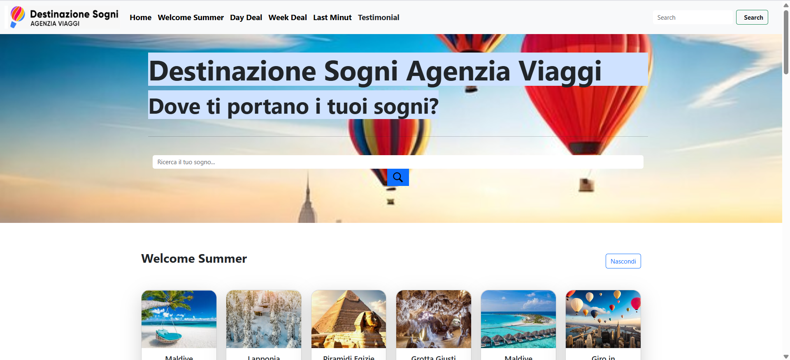
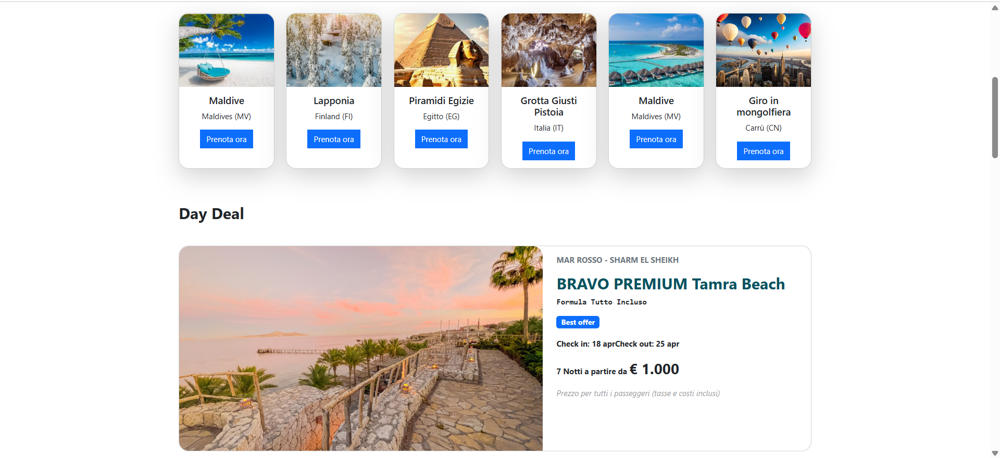
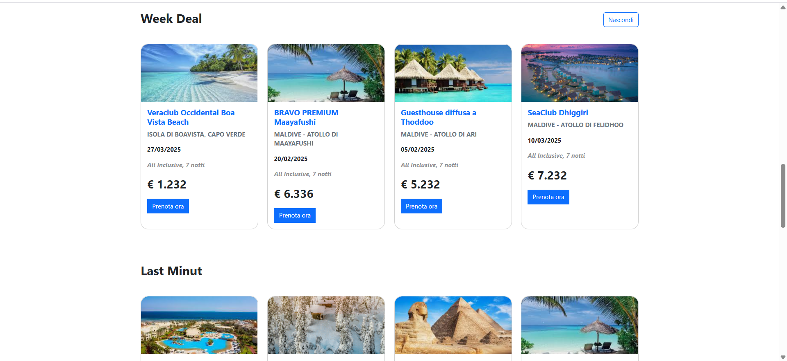

# ✈️ Agenzia Viaggi (Landing Page)

Una landing page statica per un’agenzia di viaggi, realizzata con HTML e CSS.
Struttura pulita, immagini d’impatto (in img/) e layout pensato per presentare offerte/mete in modo chiaro e responsive.

### Demo live  

https://alina-galben.github.io/AgenziaViaggi/

---
### 📚 Home Page   

<p align="center">
  
  
  
</p>


## Linguaggi in repo:
 

  


## Cosa trovi nel progetto
- Pagina unica `index.html` con sezioni tipiche di una landing (header, hero/immagine principale, sezioni contenuti, footer). 
- Stili centralizzati in `style.css` per layout, tipografia e responsive. 
- Risorse grafiche nella cartella img/. 

---

## Come eseguirla in locale
#### Clona la repo:
```
git clone https://github.com/Alina-Galben/AgenziaViaggi.git
cd AgenziaViaggi
```
#### Apri index.html nel tuo browser  
(consigliato: estensione Live Server di VS Code per il refresh automatico).

#### Personalizzazione
- Immagini: sostituisci i file in img/ con le tue foto/cover.
- Colori & Font: modifica palette, spaziature e tipografia in `style.css`.
- Sezioni: aggiungi o riorganizza blocchi in `index.html` (es. “Destinazioni top”, “Offerte della settimana”, “Chi siamo”, “Contatti”).
- Accessibilità & UX (consigli veloci)
- Usa tag semantici (header, main, section, footer).
- Assicurati contrasto testo/sfondo e alt text nelle immagini.
- Mantieni una gerarchia H1→H2→H3 coerente.
- Testa la pagina su mobile (layout, tap target, font-size).


## Roadmap / Idee di miglioramento
- Navbar sticky con ancore di sezione.
- Sezione card offerte con griglia responsive e hover state.
- Form contatti (solo markup, oppure integrazione con un backend o Formspree).
- Animazioni leggere (transizioni CSS) per dare dinamica.
- Tema scuro/chiaro con una semplice classe theme-dark.

## Note
Progetto didattico: marchi/immagini eventualmente ispirati a terze parti restano dei rispettivi proprietari.  
Nessuna dipendenza JS esterna: solo HTML/CSS.


